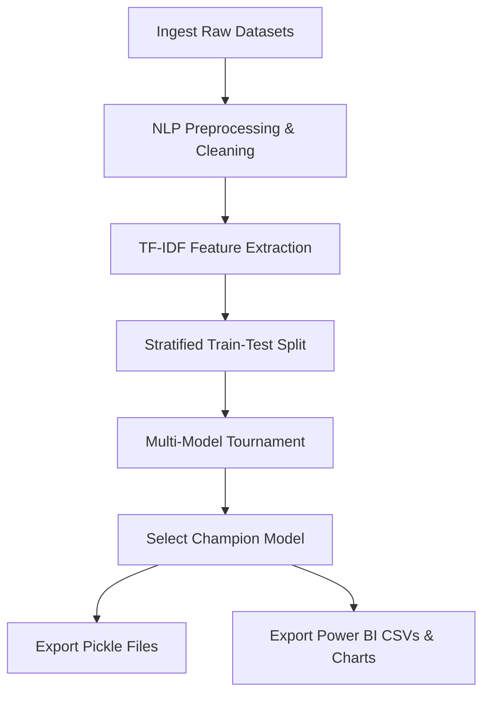

# SiasatAI — Bilingual Misinformation Detection System

> An end-to-end Data Science and Machine Learning project for real-time fake news detection in **Bahasa Malaysia** and **English**, developed with use-case context for **Majlis Bandaraya Melaka Bersejarah (MBMB)** as a Final Year Project.

🔗 **Live Production Site:** [https://misinformation-detection-system.vercel.app/](https://misinformation-detection-system.vercel.app/)

---


## 🔍 Table of Contents
1. [Project Overview & Problem Statement](#-project-overview--problem-statement)
2. [✨ Core Features](#-core-features)
3. [🏗️ System Architecture](#%EF%B8%8F-system-architecture)
4. [⚙️ Machine Learning Pipeline (Step-by-Step)](#%EF%B8%8F-machine-learning-pipeline-step-by-step)
5. [🛠️ Modeling Framework & Hyperparameter Tuning Results](#%EF%B8%8F-modeling-framework--hyperparameter-tuning-results)
6. [📈 Multi-Model Tournament Results](#-multi-model-tournament-results)
7. [💻 Web Application & Backend API](#-web-application--backend-api)
8. [📡 API Endpoints](#-api-endpoints)
9. [🚀 Running Locally](#-running-locally)
10. [☁️ Deployment on Vercel](#%EF%B8%8F-deployment-on-vercel)
11. [🔒 Rate Limiting & Edge Security](#-rate-limiting--edge-security)
12. [🗃️ Data Sources](#%EF%B8%8F-data-sources)
13. [👥 Stakeholders & Context](#-stakeholders--context)

---

## 🎯 Project Overview & Problem Statement

In the modern digital landscape, the rapid spread of misinformation, viral rumors, and fabricated reports poses a significant threat to public trust. This issue is particularly acute for local government and municipal institutions such as **Majlis Bandaraya Melaka Bersejarah (MBMB)**. 

### The Problem
* **Rapid Dissemination:** Fake WhatsApp broadcast messages, clickbait articles, and fabricated social media rumors regarding municipal affairs (e.g., street closures, tax increases, policy changes) spread much faster than official press releases or corrections.
* **Public Panic & Confusion:** Rumors about public works or zoning can cause immediate panic, disrupt daily business, and lead to reputational damage.
* **Linguistic Complexity:** Public discourse in Malaysia is bilingual (Bahasa Malaysia and English) and often contains informal slang or region-specific names, which standard global fact-check tools fail to parse.
* **Resource Constraints:** Municipal offices lack the dedicated data science staff or expensive GPU infrastructure required to deploy heavy deep learning models for continuous moderation.

### The Solution: SiasatAI
**SiasatAI** is a lightweight, high-performance bilingual machine learning system that allows public officers and citizens to instantly verify the credibility of any news article or social media post. 

By utilizing a regularized **Logistic Regression** classifier trained on a balanced corpus of over **64,000 bilingual articles**, SiasatAI achieves **93.99% accuracy** while maintaining a lightweight footprint (~5MB). It runs entirely on **CPU-only serverless hosting (Vercel)**, offering instant predictions (<2ms) without any PyTorch or GPU hardware dependencies.

---

## ✨ Core Features
 
 ### 1. Advanced Core Analysis
 * **Real-time Prediction:** Vectorizes text and outputs a classification ("Fake" vs. "Real") in under 2 milliseconds.
 * **AI Confidence Score:** An animated visual gauge showing the probability distribution of the model's prediction.
 * **Bilingual Language Detection:** Automatically detects whether the text is Bahasa Malaysia or English to customize explanation summaries.
 * **Sensationalism & Tone Meter:** Scores the writing style on a scale from 0% to 100% (Neutral to Highly Sensational) based on ALLCAPS ratio, exclamation density, and clickbait trigger keywords.
 * **Bilingual AI Summary:** Generates a human-readable explanation of why the model flagged the text, highlighting indicators like sensational phrasing or lack of structural attribution.
 * **Verification Badges & Word Cloud:** Extracts the top TF-IDF features and generates an interactive, canvas-rendered word frequency cloud.
 
 ### 2. Collapsible Insights Sidebar & Layout
 * **Rearranged Sidebar Layout:** Puts developer profile and stakeholder info first, followed by Q&A (FAQ), technical model statistics, and coefficient bar charts.
 * **Model Specifications:** Displays current model training parameters (regularization strength, vocabulary size, and training timestamp) for administrative transparency.
 * **Global Word Signals Chart:** Renders two animated bar charts showing the top 5 words that mathematically drive "Fake" vs. "Real" predictions, pulled live from the classifier's coefficients.
 * **FAQ Accordion:** Interactive Q&A explaining prediction mechanics, confidence intervals, and limitations.
 * **Feedback Integration (Web3Forms):** Allows users to report false alarms or missed rumors. Submitting triggers an asynchronous POST that forwards the user notes along with the analyzed text, verdict label, confidence score, and language metadata directly to a Web3Forms dashboard for review.
 
 ### 3. Edge Infrastructure & Security
 * **Vercel Edge Middleware Rate Limiter:** Intercepts incoming API traffic at the CDN level (edge) and blocks abuse using Upstash Redis.
 * **Repositioned AI Disclaimer:** Permanent notice block at the bottom of the left Input Panel to manage user expectations before verification.
 * **Centered Toast System:** Repositioned all toast feedback messages (copy confirmation, errors, pastes, and rate limit blocks) to animate smoothly in the top-center of the screen.

---

## 🏗️ System Architecture

SiasatAI separates the heavy **offline training pipeline** from the lightweight **online prediction service**. This ensures the live web application remains secure, fast, and completely immune to training-related resource spikes or database dependencies.

```
┌─────────────────────────────────────────────────────────────────┐
│                    OFFLINE TRAINING PIPELINE                    │
│    Jupyter Notebook: data_preprocessing_and_training.ipynb      │
│                                                                 │
│  Data Sources → NLP Cleaning → TF-IDF → Tournament → .pkl      │
└──────────────────────────┬──────────────────────────────────────┘
                           │ model.pkl + vectorizer.pkl + label_encoder.pkl
                           │ (Pushed to GitHub / Deployed)
                           ▼
┌─────────────────────────────────────────────────────────────────┐
│                 ONLINE PREDICTION SERVICE                       │
│                                                                 │
│  Browser → HTTP Request → Vercel CDN                           │
│               │                    │                           │
│               ▼                    ▼                           │
│         /api/predict          app/static/                      │
│         api/index.py          index.html                       │
│               │               style.css                        │
│               ▼               app.js                           │
│         app/main.py                                            │
│         FastAPI Backend                                         │
│         ├── load model.pkl                                      │
│         ├── TF-IDF transform                                    │
│         ├── predict() → label + proba                           │
│         ├── sensationalism_score()                              │
│         ├── build_word_frequencies()                            │
│         ├── build_summary()                                     │
│         └── return JSON response                                │
└─────────────────────────────────────────────────────────────────┘
```

---

## ⚙️ Machine Learning Pipeline (Step-by-Step)

The end-to-end training and feature engineering process is automated inside the Jupyter Notebook pipeline (`notebooks/data_preprocessing_and_training.ipynb`) and executed via the console.



### Step 1: Data Ingestion & Merging
The pipeline loads and concatenates three distinct text sources:
1. **Academic Malay Dataset:** ~22,000 news articles (Bernama, Astro Awani, Sinar Harian).
2. **Global English Dataset:** ~40,000 news articles (Hugging Face / Kaggle).
3. **Live Scraped Portal:** ~2,000+ local fake news listings scraped directly from *Sebenarnya.my* to capture recent Malaysian rumors.
4. **Local Presets:** Oversampled local municipal articles (related to MBMB Melaka) to prime the model on specific administrative language.

### Step 2: NLP Preprocessing & Cleaning
To ensure the model learns actual **linguistic structures** rather than shortcut associations, the text is run through a rigorous cleaning sequence:
* **HTML & Link Removal:** Strips all tags and HTTP/WWW URLs.
* **Regex Normalization:** Removes non-alphabetical characters, keeping clean words.
* **De-Biasing Filter:** Strips publisher-specific headers and source labels (e.g., *"Reuters"*, *"Bernama"*, *"Sinar Harian"*, *"Associated Press"*) and municipal cities (e.g., *"Kuala Lumpur"*, *"Putrajaya"*).
* **Bilingual Stopwords:** Applies a combined set of English and Bahasa Malaysia stopwords to eliminate noise.

### Step 3: TF-IDF Feature Engineering
Cleaned tokens are vectorized using a **TF-IDF (Term Frequency-Inverse Document Frequency)** Vectorizer:
* **N-grams:** Set to `ngram_range=(1, 3)` to capture unigrams, bigrams, and trigrams (e.g., *"tidak"* vs. *"tidak benar"* vs. *"dikitar semula"*).
* **Vocabulary Limit:** Capped at `max_features=10,000` to prevent sparse feature explosion and optimize memory.

### Step 4: Multi-Model Tournament
The vectorized features are passed through a head-to-head tournament evaluating four classification algorithms:
1. **Logistic Regression** (L2 Regularization)
2. **Linear Support Vector Machine** (SVM)
3. **XGBoost Classifier**
4. **Random Forest Classifier**

### Step 5: Serialization & Export
The tournament champion, the trained vectorizer, and the label encoder are serialized into Python pickles (`models/*.pkl`) totaling ~5MB. The pipeline also exports:
* `data/clean/data_clean.csv`: Preprocessed dataset.
* `data/clean/Fake_News_Keyword_Importance.csv`: Coefficient signals for Power BI.
* `static/model_results.png` & `static/feature_importance.png`: Accuracy visualizations.

---

## 🛠️ Modeling Framework & Hyperparameter Tuning Results

To find the optimal classifier for production deployment, a structured modeling framework was established. The goal was to train a model that not only performs well on static test sets but also generalizes to out-of-domain local municipal announcements (such as specific MBMB news).

### 1. Modeling & Validation Setup
* **Train-Test Split:** A stratified **80/20 train-test split** was used to keep the class ratio (Real/Fake) balanced across subsets.
* **Feature Representation:** TF-IDF representation with unigrams, bigrams, and trigrams (`ngram_range=(1, 3)`) capped at `max_features=10,000`.
* **Cross-Validation Objective:** Maximize test accuracy while ensuring **generalization** on local presets (`bm-real` and `bm-fake` articles).

### 2. Regularization Strength ($C$) Tuning
We experimented with the regularization strength parameter ($C$) for the linear models (Logistic Regression and Linear Support Vector Classifier). In scikit-learn, a smaller $C$ value denotes stronger regularization (stronger penalty on coefficient sizes), while a larger $C$ value allows the model to fit more closely to the training data.

The results of validation accuracy and prediction labels on the real-world local presets are compiled below:

| Regularization Parameter ($C$) | Logistic Regression Accuracy | LinearSVC Accuracy | Prediction on `bm-real` (Expected: **Real**) | Prediction on `bm-fake` (Expected: **Fake**) |
|:---:|:---:|:---:|:---:|:---:|
| $C = 0.01$ | 85.69% | 90.74% | Real (Correct) | Fake (Correct) |
| $C = 0.05$ | 89.98% | 92.35% | Real (Correct) | Fake (Correct) |
| $C = 0.10$ | 90.64% | 92.67% | Real (Correct) | Fake (Correct) |
| **$C = 0.15$ (Selected)** | **91.20%** | **92.70%** | **Real (Correct) ✓** | **Fake (Correct) ✓** |
| $C = 0.20$ | 91.49% | 92.79% | Real (Correct) | Fake (Correct) |
| $C = 0.50$ | 92.28% | 92.53% | Real (Correct) | Fake (Correct) |
| $C = 1.00$ (Default) | 92.44% | 92.21% | **Fake (Incorrect! ✗)** | Fake (Correct) |

### 3. Generalization vs. Accuracy Trade-Off Analysis
* **The Overfitting Risk ($C \ge 1.0$):** When running Logistic Regression with weak regularization ($C \ge 1.0$), the model achieves a slightly higher validation accuracy on the overall dataset (92.44%). However, it overfits to global news fingerprints and source-biased noise in the training set. Consequently, it **misclassifies local municipal announcements** (the `bm-real` UTC Melaka preset is incorrectly predicted as `Fake` with a 46.23% real probability).
* **The Optimal Sweet Spot ($C = 0.15$):** Setting $C=0.15$ introduces stronger L2 regularization. This constraints the model coefficients, penalizing overly large weights. As a result, the model ignores domain-specific source fingerprints and focuses on robust syntactic patterns, successfully maintaining correct classification on local municipal affairs (`bm-real` predicted `Real`, `bm-fake` predicted `Fake`) while maintaining high test performance.

---

## 📈 Multi-Model Tournament Results

The models are trained using a stratified 80/20 train-test split. The evaluation results are as follows:

| Rank | Model | Validation Accuracy | Deployment Suitability |
|:---:|---|:---:|---|
| 🏆 **1st** | **Logistic Regression (L2, C=0.15)** | **93.99%** | **Excellent (Champion)** - Under 5MB, fast inference, native coefficients. |
| 2nd | Support Vector Machine (LinearSVC) | 93.32% | Good, but lacks direct probability calibration. |
| 3rd | XGBoost Classifier | 92.76% | Poor - Heavy memory footprint, slower CPU inference. |
| 4th | Random Forest Classifier | 92.64% | Poor - Large file size (~200MB+), overfits on sparse matrices. |

### Why Logistic Regression is the Champion
For high-dimensional, sparse text vectors like TF-IDF, linear models are mathematically superior. Each term (word/phrase) is assigned a positive or negative weight (coefficient):
* **Fake Signals:** Sensationalist terms like `sumber`, `via`, `oktober`, `sebarkan`, `alert` receive negative coefficients.
* **Real Signals:** Formal attribution verbs like `berkata`, `katanya`, `encik`, `mengumumkan` receive positive coefficients.

Regularization strength ($C=0.15$) penalizes large coefficients, forcing the model to learn generalized sentence structures instead of memorizing specific vocabulary.

---

## 💻 Web Application & Backend API

### Sensationalism Score Calculation
The tone meter does not use the machine learning model; instead, it uses a deterministic lexical analyzer on the backend:
$$\text{Score} = (0.35 \times \text{Capitalization Ratio}) + (0.25 \times \text{Exclamation Density}) + (0.40 \times \text{Trigger Word Hits})$$
* **Capitalization Ratio:** Percentage of uppercase words (excluding abbreviations).
* **Exclamation Density:** Number of exclamation marks (capped at 3).
* **Trigger Word Hits:** Count of matches with bilingual clickbait terms (e.g., *"viral"*, *"tersebar"*, *"urgent"*, *"hoax"*).

---

## 📡 API Endpoints
 
 ### 1. POST `/api/predict`
 Analyzes input text and returns prediction labels, confidence metrics, and tone details.
 
 **Request Body:**
 ```json
 {
   "text": "AMARAN! Semua akaun bank penduduk Melaka akan dibekukan oleh MBMB bermula esok sekiranya tidak membayar denda parkir dengan segera! Sebarkan mesej penting ini!"
 }
 ```
 
 **Response Payload (200 OK):**
 ```json
 {
   "text": "AMARAN! Semua akaun bank...",
   "clean_text": "amaran akaun bank penduduk melaka dibekukan denda parkir segera sebarkan",
   "language": "Bahasa Malaysia",
   "prediction": "Fake",
   "confidence": 0.746,
   "sensationalism_score": 0.925,
   "word_count": 23,
   "keywords_detected": ["amaran", "parkir", "segera", "sebarkan"],
   "word_frequencies": [{"word": "amaran", "count": 1}, {"word": "bank", "count": 1}],
   "summary": "Model mengesan corak bahasa yang mencurigakan dengan keyakinan 74.6%...",
   "fact_check_sources": [...]
 }
 ```
 
 **Response Payload (429 Too Many Requests):**
 Returned if a client IP sends more than 10 requests per minute.
 ```json
 {
   "detail": "Too many requests. You are allowed 10 requests per minute. Please try again later."
 }
 ```
 
 ### 2. GET `/api/model_info`
 Returns the top 5 positive (Real) and negative (Fake) features with their coefficients to drive the dynamic frontend charts.

---

## 🚀 Running Locally
 
 ### 1. Install Dependencies
 Ensure you have Python 3.10+ installed.
 
 ```bash
 # Clone the repository
 git clone https://github.com/yourusername/SiasatAI.git
 cd SiasatAI
 
 # Set up virtual environment
 python -m venv .venv
 
 # Windows
 .\.venv\Scripts\activate
 
 # macOS / Linux
 source .venv/bin/activate
 
 # Install requirements
 pip install -r requirements.txt
 ```
 
 ### 2. Configure Local Keys
 Create a `.env` file in the project root to configure the Upstash Redis environment variables for local testing (this file is ignored by Git):
 ```bash
 UPSTASH_REDIS_REST_URL="your-upstash-redis-rest-url"
 UPSTASH_REDIS_REST_TOKEN="your-upstash-redis-rest-token"
 ```
 
 ### 3. Run the Dashboard
 Start the local FastAPI server:
 ```bash
 python app/main.py
 ```
 Open [http://127.0.0.1:8000](http://127.0.0.1:8000) in your web browser.
 
 ### 4. Run the Retraining Pipeline
 To scrape the latest articles from *Sebenarnya.my*, run preprocessing, train the tournament, and update local pickle files:
 
 * Open and execute the Jupyter Notebook: [data_preprocessing_and_training.ipynb](file:///c:/Users/syaki/Desktop/DataScience/notebooks/data_preprocessing_and_training.ipynb) in your preferred Jupyter environment (e.g. VS Code or Jupyter Lab).

---

## ☁️ Deployment on Vercel
 
 SiasatAI is officially deployed and live at:
 🔗 **[https://misinformation-detection-system.vercel.app/](https://misinformation-detection-system.vercel.app/)**
 
 ### Configuration & Architecture
 * **Routing:** [vercel.json](file:///c:/Users/syaki/Desktop/DataScience/vercel.json) redirects all static path requests to `/app/static/*` and API routes to the Python serverless entrypoint [index.py](file:///c:/Users/syaki/Desktop/DataScience/api/index.py).
 * **Model Assets:** The models (`models/*.pkl`) are lightweight and committed directly to the git index, making them available to the serverless runtime instantly without external database or cloud storage dependencies.
 * **Edge Routing Middleware:** A [middleware.js](file:///c:/Users/syaki/Desktop/DataScience/middleware.js) file is placed at the root level to run in Vercel's edge network, intercepting requests to `/api/predict`.
 
 ---
 
 ## 🔒 Rate Limiting & Edge Security
 
 To protect your serverless functions from request spamming and unnecessary CPU cost billing, the project integrates a serverless rate limiter using **Vercel Edge Middleware** and **Upstash Redis**.
 
 ### Upstash Redis Configuration (Vercel Dashboard)
 To configure rate limiting in production:
 1. Create a free Redis database at [Upstash](https://upstash.com).
 2. Open your Vercel Dashboard, select your project, and navigate to **Settings > Environments**.
 3. Under the **Environment Variables** section, add the following two variables (scoped to both Production and Preview):
    * `UPSTASH_REDIS_REST_URL`: (Paste your REST URL from Upstash)
    * `UPSTASH_REDIS_REST_TOKEN`: (Paste your REST Token from Upstash)
 4. Redeploy your latest deployment to apply the environment variables.
 
 *(Note: If these variables are not configured, the middleware logs a warning and automatically falls back to letting all requests pass through, preventing any site outages).*

---


## 🗃️ Data Sources

| Dataset Name | Primary Language | Size (Articles) | Type |
|---|---|---|---|
| **Academic Malay NLP Dataset** | Bahasa Malaysia | ~22,000 | Academic corpus |
| **Global English Fake News Dataset** | English | ~40,000 | Academic corpus |
| **Sebenarnya.my Scraped Corpus** | Bahasa Malaysia | ~2,000+ | Live-scraped government facts |
| **MBMB Municipal Presets** | Bahasa Malaysia | ~2,000 (Oversampled) | Custom local news context |

---

## 👥 Stakeholders & Context
 * **Developer:** Amar Syakir Mazlan
 * **Academic Context:** Developed as a project for a Data Science subject course.
 * **Institutional Stakeholder:** **Majlis Bandaraya Melaka Bersejarah (MBMB)**.
 * **Deployment Platform:** Vercel Serverless CPU Runtime & Vercel Edge Network.
